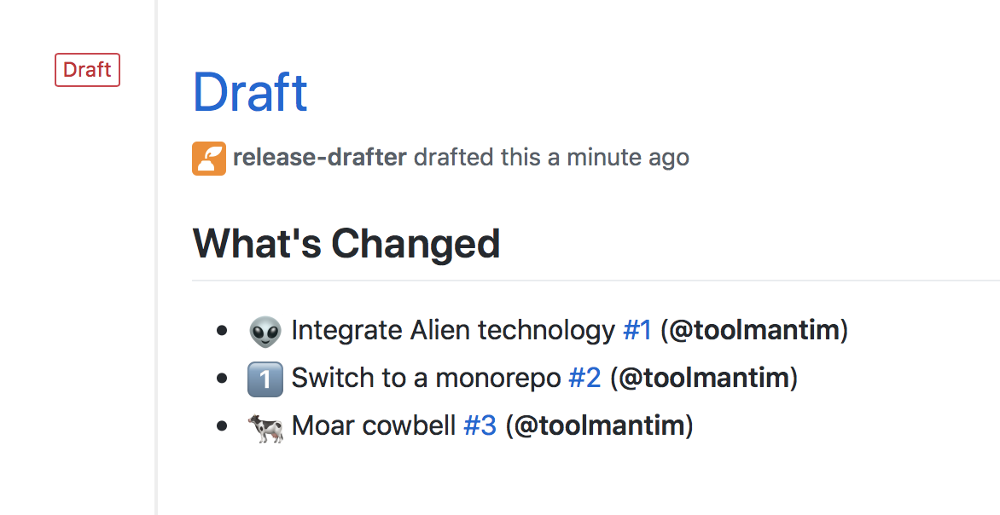
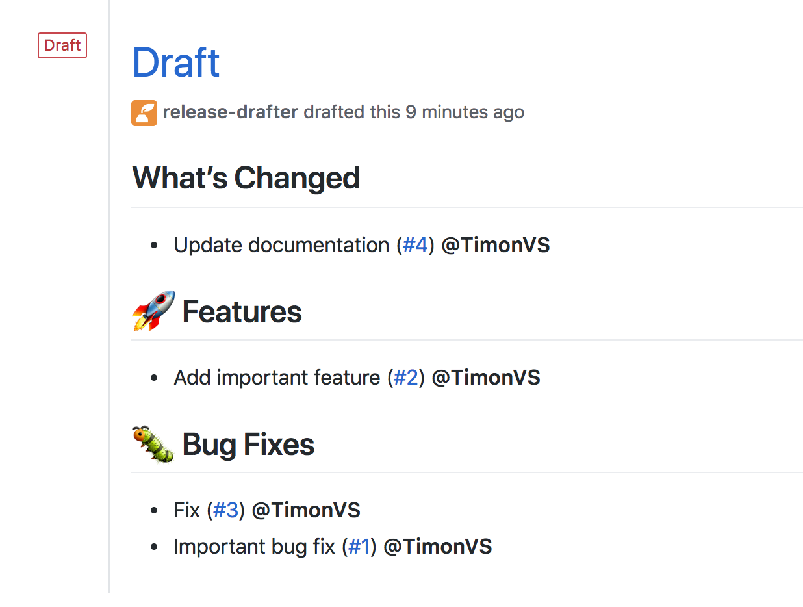

<h1 align="center">
  
</h1>

<p align="center">Drafts your next release notes as pull requests are merged into master.</p>


## Usage

You can use the
[Release Drafter GitHub Action](https://github.com/marketplace/actions/release-drafter)
in a
[GitHub Actions Workflow](https://help.github.com/en/actions/about-github-actions)
by configuring a YAML-based workflow file, e.g.
`.github/workflows/release-drafter.yml`, with the following:

```yaml
name: Release Drafter

on:
  push:
    branches:
      - main
      - master

# Permissions for default token (secrets.GITHUB_TOKEN)
permissions:
  contents: write
  pull-requests: read

jobs:
  update_release_draft:
    runs-on: ubuntu-latest
    steps:
      - uses: release-drafter/release-drafter@v7
        with:
          config-name: release-drafter.yml # the default, loads '.github/release-drafter.yml'
```

## Configuration

The action requires a configuration file. Default location is
`.github/release-drafter.yml`, and will be fetched using octokit behind the
scenes. You do not need to checkout your repository beforehand.

> [!note]  
> For advanced scenarios, please read dedicated
> [Configuration Loading](./docs/configuration-loading.md) article. (ex: dynamic
> config, extending other files, fetch from another repo, etc...)

### Example

For example, take the following `.github/release-drafter.yml` file in a
repository:

```yml
template: |
  ## What’s Changed

  $CHANGES
```

As pull requests are merged, a draft release is kept up-to-date listing the
changes, ready to publish when you’re ready:



The following is a more complicated configuration, which categorises the changes
into headings, and automatically suggests the next version number:

```yml
name-template: "v$RESOLVED_VERSION 🌈"
tag-template: "v$RESOLVED_VERSION"
categories:
  - title: "🚀 Features"
    semver-increment: minor
    when:
      labels:
        - "feature"
        - "enhancement"
  - title: "🐛 Bug Fixes"
    when:
      labels:
        - "fix"
        - "bugfix"
        - "bug"
  - title: "🧰 Maintenance"
    when:
      label: "chore"
  - type: "pre-exclude"
    when:
      label: "skip-changelog"
  - type: "version-resolver"
    semver-increment: "major"
    when:
      label: "major"
  - type: "version-resolver"
    semver-increment: "patch"
change-template: "- $TITLE @$AUTHOR (#$NUMBER)"
change-title-escapes: '\<*_&' # You can add # and @ to disable mentions, and add ` to disable code blocks.
template: |
  ## Changes

  $CHANGES
```

## Configuration Options

You can configure Release Drafter using the following key in your
`.github/release-drafter.yml` file:

| Key                        | Required | Description                                                                                                                                                                                                                                              |
| -------------------------- | -------- | -------------------------------------------------------------------------------------------------------------------------------------------------------------------------------------------------------------------------------------------------------- |
| `template`                 | Required | The template for the body of the draft release. Use [template variables](#template-variables) to insert values.                                                                                                                                          |
| `header`                   | Optional | Will be prepended to `template`. Use [template variables](#template-variables) to insert values.                                                                                                                                                         |
| `footer`                   | Optional | Will be appended to `template`. Use [template variables](#template-variables) to insert values.                                                                                                                                                          |
| `category-template`        | Optional | The template to use for each category. Use [category template variables](#category-template-variables) to insert values. Default: `"## $TITLE"`.                                                                                                         |
| `name-template`            | Optional | The template for the name of the draft release. For example: `"v$NEXT_PATCH_VERSION"`.                                                                                                                                                                   |
| `tag-template`             | Optional | The template for the tag of the draft release. For example: `"v$NEXT_PATCH_VERSION"`.                                                                                                                                                                    |
| `tag-prefix`               | Optional | A known prefix used to filter release tags. For matching tags, this prefix is stripped before attempting to parse the version. Default: `""`                                                                                                             |
| `version-template`         | Optional | The template to use when calculating the next version number for the release. Useful for projects that don't use semantic versioning. Default: `"$MAJOR.$MINOR.$PATCH$PRERELEASE"`                                                                       |
| `change-template`          | Optional | The template to use for each merged pull request. Use [change template variables](#change-template-variables) to insert values. Default: `"* $TITLE (#$NUMBER) @$AUTHOR"`.                                                                               |
| `change-title-escapes`     | Optional | Characters to escape in `$TITLE` when inserting into `change-template` so that they are not interpreted as Markdown format characters. Default: `""`                                                                                                     |
| `no-changes-template`      | Optional | The template to use for when there’s no changes. Default: `"* No changes"`.                                                                                                                                                                              |
| `references`               | Optional | The references to listen for configuration updates to `.github/release-drafter.yml`. Refer to [References](#references) to learn more about this                                                                                                         |
| `categories`               | Optional | Define how changes are filtered, grouped, and versioned. Categories support `type`, `when`, `exclusive`, `collapse-after`, and `semver-increment`. Refer to [Categorize Changes](#categorize-changes).                                                   |
| `exclude-contributors`     | Optional | Exclude specific usernames from the generated `$CONTRIBUTORS` variable. Refer to [Exclude Contributors](#exclude-contributors) to learn more about this option.                                                                                          |
| `no-contributors-template` | Optional | The template to use for `$CONTRIBUTORS` when there's no contributors to list. Default: `"No contributors"`.                                                                                                                                              |
| `replacers`                | Optional | Search and replace content in the generated changelog body. Refer to [Replacers](#replacers) to learn more about this option.                                                                                                                            |
| `sort-by`                  | Optional | Sort changelog by merged_at or title. Can be one of: `merged_at`, `title`. Default: `merged_at`.                                                                                                                                                         |
| `sort-direction`           | Optional | Sort changelog in ascending or descending order. Can be one of: `ascending`, `descending`. Default: `descending`.                                                                                                                                        |
| `prerelease`               | Optional | Whether to draft a prerelease, with changes since another prerelease (if applicable). Default `false`.                                                                                                                                                   |
| `prerelease-identifier`    | Optional | A string indicating an identifier (alpha, beta, rc, etc), to increment the prerelease version. This automatically enables `prerelease` when both options come from the same config location; explicit action inputs still take precedence. Default `''`. |
| `include-pre-releases`     | Optional | When looking for the last published release to scan changes up-to, include pre-releases. Has no effect if using `prerelease: true` (already enabled). Default `false`.                                                                                   |
| `latest`                   | Optional | Mark the release as latest. Only works for published releases. Can be one of: `true`, `false`, `legacy`. Default `true`.                                                                                                                                 |
| `commitish`                | Optional | The release target, i.e. branch or commit it should point to. Default: the ref that release-drafter runs for, e.g. `refs/heads/master` if configured to run on pushes to `master`.                                                                       |
| `filter-by-range`          | Optional | Filter releases that satisfies a semver range. Evaluates the tag name againts node's `semver.satisfies()`. Default : `"*"`.                                                                                                                              |
| `filter-by-commitish`      | Optional | Filter previous releases to consider only those with the target matching `commitish`. Default: `false`.                                                                                                                                                  |
| `pull-request-limit`       | Optional | Limit for associatedPullRequests API call. Use this when working with long-lived non-default branches. See #1354. Default: `5`                                                                                                                           |
| `history-limit`            | Optional | Size of the pagination window when walking the repo. Can avoid erratic 502s from Github. Default: `15`                                                                                                                                                   |

## Template Variables

You can use any of the following variables in your `template`, `header` and
`footer`:

| Variable        | Description                                                                                                           |
| --------------- | --------------------------------------------------------------------------------------------------------------------- |
| `$CHANGES`      | The markdown list of pull requests that have been merged.                                                             |
| `$CONTRIBUTORS` | A comma separated list of contributors to this release (pull request authors, commit authors, and commit committers). |
| `$PREVIOUS_TAG` | The previous releases’s tag.                                                                                          |
| `$REPOSITORY`   | Current Repository                                                                                                    |
| `$OWNER`        | Current Repository Owner                                                                                              |

## Category Template Variables

You can use any of the following variables in `category-template`:

| Variable | Description                          |
| -------- | ------------------------------------ |
| `$TITLE` | The category title, e.g. `Features`. |

## Next Version Variables

You can use any of the following variables in your `template`, `header`,
`footer`, `name-template` and `tag-template`:

| Variable                   | Description                                                                                                                                                                                                                    |
| -------------------------- | ------------------------------------------------------------------------------------------------------------------------------------------------------------------------------------------------------------------------------ |
| `$NEXT_PATCH_VERSION`      | The next patch version number. For example, if the last tag or release was `v1.2.3`, the value would be `v1.2.4`. This is the most commonly used value.                                                                        |
| `$NEXT_MINOR_VERSION`      | The next minor version number. For example, if the last tag or release was `v1.2.3`, the value would be `v1.3.0`.                                                                                                              |
| `$NEXT_MAJOR_VERSION`      | The next major version number. For example, if the last tag or release was `v1.2.3`, the value would be `v2.0.0`.                                                                                                              |
| `$NEXT_PRERELEASE_VERSION` | The next prerelease suffix. Depends on `prerelease-identifier`. Ex: `v1.2.3-beta.3`. Default : `''`                                                                                                                            |
| `$RESOLVED_VERSION`        | The next resolved version number, based on which categories the matching changes end up in and the `semver-increment` configured on those categories. Refer to [Version Resolver](#version-resolver) to learn more about this. |

### Next Version Component Helpers

For each of the `$NEXT_{MAJOR,MINOR,PATCH}_VERSION` variables, additional
component helper variables are available that extract individual version
components:

| Variable                              | Description                                                        |
| ------------------------------------- | ------------------------------------------------------------------ |
| `$NEXT_MAJOR_VERSION_MAJOR`           | Major component of `$NEXT_MAJOR_VERSION`.                          |
| `$NEXT_MAJOR_VERSION_MINOR`           | Minor component of `$NEXT_MAJOR_VERSION`.                          |
| `$NEXT_MAJOR_VERSION_PATCH`           | Patch component of `$NEXT_MAJOR_VERSION`.                          |
| `$NEXT_MINOR_VERSION_MAJOR`           | Major component of `$NEXT_MINOR_VERSION`.                          |
| `$NEXT_MINOR_VERSION_MINOR`           | Minor component of `$NEXT_MINOR_VERSION`.                          |
| `$NEXT_MINOR_VERSION_PATCH`           | Patch component of `$NEXT_MINOR_VERSION`.                          |
| `$NEXT_PATCH_VERSION_MAJOR`           | Major component of `$NEXT_PATCH_VERSION`.                          |
| `$NEXT_PATCH_VERSION_MINOR`           | Minor component of `$NEXT_PATCH_VERSION`.                          |
| `$NEXT_PATCH_VERSION_PATCH`           | Patch component of `$NEXT_PATCH_VERSION`.                          |
| `$NEXT_PRERELEASE_VERSION_PRERELEASE` | Prerelease segment of `$NEXT_PRERELEASE_VERSION`. Ex : `'-beta.3'` |

## Version Template Variables

You can use any of the following variables in `version-template` to format the
[Next Version Variables](#next-version-variables):

| Variable      | Description                                                     |
| ------------- | --------------------------------------------------------------- |
| `$PATCH`      | The patch version number.                                       |
| `$MINOR`      | The minor version number.                                       |
| `$MAJOR`      | The major version number.                                       |
| `$PRERELEASE` | The prerelease suffix (for example `-rc.0`) or an empty string. |

You may want to use this when producing non semver output.

```yaml
version-template: "ver $MAJOR"
```

> [!IMPORTANT]
>
> If you want the next release-drafter run to parse your version, stick to
> versions parseable by semver.coerce() (we enbale `loose` mode)
>
> ```ts
> semver.coerce("ver 1", true); // { version: '1.0.0' }
> ```
>
> If you simply want a verbose title for your releases, use the `name-template`
> config, and leave versions strictly semver-compliant.

## Version Resolver

Any category with `semver-increment` contributes to `$RESOLVED_VERSION`.
Use `type: version-resolver` categories when you want version resolution rules
that do not also render a changelog section.

Before version resolution runs, any `pre-include` and `pre-exclude` categories
filter the candidate pull requests. After that:

- `type: changelog` categories contribute only for pull requests that end up
  assigned to that changelog category
- `type: version-resolver` categories contribute from their own matches without
  rendering a changelog section
- the highest matching increment wins across both category types

Category order matters when `exclusive: true` is used. Exclusivity is evaluated
independently for changelog categories and version-resolver categories.

```yml
categories:
  - type: "version-resolver"
    semver-increment: "major"
    when:
      label: "major"
  - type: "version-resolver"
    semver-increment: "minor"
    when:
      label: "minor"
  - type: "version-resolver"
    semver-increment: "patch"
    when:
      label: "patch"
  - type: "version-resolver"
    semver-increment: "patch"
```

The example above:

- uses matching categories to resolve `major`, `minor`, or `patch`
- uses the category with no `when` as the fallback when nothing else matches
- picks the highest semver increment across matching categories

## Change Template Variables

You can use any of the following variables in `change-template`:

| Variable         | Description                                                                                                                                                                                                                                                                                                                                                                            |
| ---------------- | -------------------------------------------------------------------------------------------------------------------------------------------------------------------------------------------------------------------------------------------------------------------------------------------------------------------------------------------------------------------------------------- |
| `$NUMBER`        | The number of the pull request, e.g. `42`.                                                                                                                                                                                                                                                                                                                                             |
| `$TITLE`         | The title of the pull request, e.g. `Add alien technology`. Any characters excluding @ and # matching `change-title-escapes` will be prepended with a backslash so that they will appear verbatim instead of being interpreted as markdown format characters. @s and #s if present in `change-title-escapes` will be appended with an HTML comment so that they don't become mentions. |
| `$AUTHOR`        | The pull request author’s username, e.g. `gracehopper`.                                                                                                                                                                                                                                                                                                                                |
| `$BODY`          | The body of the pull request e.g. `Fixed spelling mistake`.                                                                                                                                                                                                                                                                                                                            |
| `$URL`           | The URL of the pull request e.g. `https://github.com/octocat/repo/pull/42`.                                                                                                                                                                                                                                                                                                            |
| `$BASE_REF_NAME` | The base name of of the base Ref associated with the pull request e.g. `master`.                                                                                                                                                                                                                                                                                                       |
| `$HEAD_REF_NAME` | The head name of the head Ref associated with the pull request e.g. `my-bug-fix`.                                                                                                                                                                                                                                                                                                      |

## References

**Note**: This is only relevant for GitHub app users as `references` is ignored
when running as GitHub action due to GitHub workflows more powerful
[`on` conditions](https://help.github.com/en/actions/reference/workflow-syntax-for-github-actions#on)

References takes an list and accepts strings and regex. If none are specified,
we default to the repository’s default branch usually master.

```yaml
references:
  - master
  - v.+
```

Currently matching against any `ref/heads/` and `ref/tags/` references behind
the scene

## Categorize Changes

With the `categories` option you can describe the full change classification
pipeline:

- `type: changelog` groups matching changes in the rendered release notes
- `type: pre-include` keeps only matching changes for later processing
- `type: pre-exclude` removes matching changes before changelog generation
- `type: version-resolver` affects `$RESOLVED_VERSION` without rendering a
  changelog section

`pre-include` always runs before `pre-exclude`, and both category types affect
both changelog generation and version resolution.

Categories are evaluated in the order they are defined. By default, a pull
request can match multiple categories of the same type. Setting `exclusive:
true` on a `changelog` or `version-resolver` category stops later categories of
that same type from also matching the same pull request.

Each category supports the following keys:

| Key                | Applies to                      | Description                                                                                                                                               |
| ------------------ | ------------------------------- | --------------------------------------------------------------------------------------------------------------------------------------------------------- |
| `type`             | All categories                  | Category behavior. Defaults to `changelog`.                                                                                                               |
| `title`            | `changelog`                     | Required for changelog categories because `category-template` renders it. Ignored for `pre-include`, `pre-exclude`, and `version-resolver`.               |
| `when`             | All categories                  | Match conditions. Omit it or use an empty array to match all changes.                                                                                     |
| `exclusive`        | `changelog`, `version-resolver` | Prevents later categories of the same type from also matching the same pull request. Defaults to `false`.                                                 |
| `collapse-after`   | `changelog`                     | Collapses long changelog sections into `<details>`. `0` always collapses, `-1` disables collapsing. Defaults to `-1`.                                     |
| `semver-increment` | `changelog`, `version-resolver` | Version increment contributed by matching changes. Can be `major`, `minor`, or `patch`. Defaults to `patch`. Ignored for `pre-include` and `pre-exclude`. |

Each category can define a `when` condition as either:

- a single condition object
- an array of condition objects, where matching any one condition is enough

Within one condition, label and path predicates are combined with AND logic.

The condition keys are:

| Key           | Description                                                             |
| ------------- | ----------------------------------------------------------------------- |
| `label`       | Shorthand for one `labels` entry.                                       |
| `labels`      | Label predicates to compare against the pull request labels.            |
| `labels-mode` | How the configured labels are matched. Defaults to `any`.               |
| `path`        | Shorthand for one `paths` entry.                                        |
| `paths`       | Glob patterns to compare against the files changed by the pull request. |
| `paths-mode`  | How the configured paths are matched. Defaults to `any`.                |

```yml
categories:
  - title: "🚀 Features"
    semver-increment: "minor"
    when:
      labels:
        - "feature"
        - "enhancement"
  - title: "🐛 Bug Fixes"
    when:
      - labels:
          - "bug"
          - "fix"
      - labels:
          - "regression"
        paths:
          - "src/**"
  - title: "⬆️ Dependencies"
    collapse-after: 0
    exclusive: true
    when:
      label: "dependencies"
  - type: "pre-exclude"
    when:
      label: "skip-changelog"
```

The `labels-mode` and `paths-mode` options control how the configured labels or
path patterns are compared. `any` is the default. Path matching operates on the
pull request's changed files.

Within a condition, `label` is shorthand for a single `labels` entry. If both
`label` and `labels` are present, they are combined before `labels-mode` is
applied. With the default `labels-mode: any`, `labels: ["feature",
"enhancement"]` matches pull requests carrying either label.

Likewise, `path` is shorthand for a single `paths` entry. If both `path` and
`paths` are present, they are combined before `paths-mode` is applied.

The available matching modes are:

- `any`: at least one configured value matches
- `all`: every configured value matches
- `only`: every change value is included in the configured set
- `exactly`: the change values and configured values are the same set

If a condition does not configure any `label`/`labels` or `path`/`paths`, the
corresponding `*-mode` setting has no effect.

An omitted or empty `when` matches all changes, but the meaning depends on the
category type:

- at most one `type: changelog` category may omit `when`; it becomes the bucket
  for otherwise uncategorized changes
- a `type: version-resolver` category with no `when` acts as the fallback when
  no other version-resolver category matches
- `pre-include` and `pre-exclude` categories with no `when` match every change

Changes with matching labels or paths will now be grouped together:



Adding such labels to your PRs can be automated by using the embedded
[Autolabeler action](#autolabeler).

Optionally you can add a `collapse-after` entry to your category item, if the
category has more than the defined `collapse-after` pull requests then it will
show all pull requests collapsed for that category. Setting `collapse-after` to
`0` will always collapse the category regardless of the number of pull requests,
and setting it to `-1` disables collapsing.
Append the `collapse-after` integer to your category as following:

```yml
categories:
  - title: "⬆️ Dependencies"
    collapse-after: 3
    when:
      label: "dependencies"
```

## Exclude Changes

The recommended way to exclude changes is a `type: pre-exclude` category.
For example, append the following to your
`.github/release-drafter.yml` file:

```yml
categories:
  - type: "pre-exclude"
    when:
      label: "skip-changelog"
```

Changes with the label "skip-changelog" will now be excluded from the
release draft.

## Include Changes

The recommended way to include only a subset of changes is a
`type: pre-include` category. Only changes that match at least one
`pre-include` category are kept for the rest of the pipeline. For example,
append the following to your
`.github/release-drafter.yml` file:

```yml
categories:
  - type: "pre-include"
    when:
      labels:
        - "app-foo"
```

Changes with the label "app-foo" will be the only changes included
in the release draft.

## Exclude Contributors

By default, the `$CONTRIBUTORS` variable will contain the names or usernames of
all the contributors of a release. The `exclude-contributors` option allows you
to remove certain usernames from that list. This can be useful if don't wish to
include yourself, to better highlight only the third-party contributions.

```yml
exclude-contributors:
  - "myusername"
```

## Replacers

You can search and replace content in the generated changelog body, using
regular expressions, with the `replacers` option. Each replacer is applied in
order.

```yml
replacers:
  - search: '/CVE-(\d{4})-(\d+)/g'
    replace: "https://cve.mitre.org/cgi-bin/cvename.cgi?name=CVE-$1-$2"
  - search: "myname"
    replace: "My Name"
  - search: "/- ([a-z])/g"
    replace: '- \u$1' # Uppercase the first letter of each changelog entry
```

`search` will be parsed to a RegExp, and `replace` supports substitution in the
[same flavour VSCode does](https://code.visualstudio.com/docs/editing/codebasics#_case-changing-in-regex-replace).

## Autolabeler

You can add automatically a label into a pull request, with the `autolabeler`
action.

```yaml
name: Auto Label

on:
  pull_request:
    # Only following types are handled by the action, but one can default to all as well
    types: [opened, reopened, synchronize]
  # pull_request_target event is required for autolabeler to support PRs from forks
  # pull_request_target:
  #   types: [opened, reopened, synchronize]

permissions:
  contents: read

jobs:
  auto_label:
    permissions:
      pull-requests: write
    runs-on: ubuntu-latest
    steps:
      # runs autolabeler
      - uses: release-drafter/release-drafter/autolabeler@v7
```

Available matchers are `files` (glob), `branch` (regex), `title` (regex) and
`body` (regex). Matchers are evaluated independently; the label will be set if
at least one of the matchers meets the criteria.

```yml
# .github/release-drafter.yml
autolabeler:
  - label: "chore"
    files:
      - "*.md"
    branch:
      - '/docs{0,1}\/.+/'
  - label: "bug"
    branch:
      - '/fix\/.+/'
    title:
      - "/fix/i"
  - label: "enhancement"
    branch:
      - '/feature\/.+/'
    body:
      - "/JIRA-[0-9]{1,4}/"

# ... rest of release-drafter config
```

## Prerelease workflow

Release draft supports working with prereleases. It expects your workflow to be
:

- A stable release is published, ex: `v3.5.0`
- You merge or add meaningful changes your users may want to see, but you are
  not quite ready for production
- You publish a prerelease, ex: `v3.5.0-rc.1`
- You merge more changes
- You publish another prerelease, ex: `v3.5.0-rc.2`
- You decide code is ready for production, you publish `v3.5.1` (or another
  increment based on your changes)

With release-drafter, you can draft each of these releases and prereleases with
the appropriate content using parameter '`prerelease`' and
'`prerelease-identifier`' - available as either an input of from the
config-file.

```yaml
jobs:
  update_full_release_draft:
    runs-on: ubuntu-latest
    steps:
      - uses: release-drafter/release-drafter@v6
        with:
          prerelease: false # the default
          # ... rest of your config
  update_prerelease_draft:
    runs-on: ubuntu-latest
    steps:
      - uses: release-drafter/release-drafter@v6
        with:
          prerelease: true
          prerelease-identifier: "rc" # Use semver identifiers : alpha, beta, rc, etc
```

Here, both jobs run in parallel every time you add changes to the configured
branch.

- `update_full_release_draft` will pile-up changes since `v3.5.0` inside a draft
  for `v3.5.1` (or `v3.6.0` or `v4.0.0`, depending on your config)
- `update_prerelease_draft` will pile-up changes since the last prerelease in a
  prerelease-draft. Changes are :
  - if no previous (published) prereleases are found - changes since `v3.5.0` in
    a draft for `v3.5.0-rc.1` (prerelease-draft)
  - or if `v3.5.0-rc.1` exists (published) already - changes since `v3.5.0-rc.1`
    in a draft for `v3.5.0-rc.2` (prerelease-draft)

Some users like to run `update_prerelease_draft` with `publish: true`, such as
prereleases are published immediately without the need for human intervention
(or an external automation). Since prereleases are not meant to be stable in the
first place, automation may be an acceptable risk for you too.

> [!IMPORTANT]
>
> - `prerelease-identifier` is not required when `prerelease` is enabled, but
>   your prerelease may not be named after / be associated with a tag that is
>   semver-compliant to an actual prerelease.
> - when specified, `prerelease-identifier` enables `prerelease: true` if both values come from the same config location; explicit action inputs still take precedence over config file values

If you want your stable releases to include changes since the last prerelease
instead of the last stable release, use `include-pre-releases: true`. This can
reduce the number of changes included in the stable release body, but diverges
from the standard workflow depicted above.

## Projects that don't use Semantic Versioning

If your project doesn't follow [Semantic Versioning](https://semver.org) you can
still use Release Drafter, but you may want to set the `version-template` option
to customize how the `$NEXT_{PATCH,MINOR,MAJOR}_VERSION` environment variables
are generated.

For example, if your project doesn't use patch version numbers, you can set
`version-template` to `$MAJOR.$MINOR`. If the current release is version 1.0,
then `$NEXT_MINOR_VERSION` will be `1.1`.

## Action Inputs

The Release Drafter GitHub Action accepts a number of optional inputs directly
in your workflow configuration. These will typically override default behavior
specified in your `release-drafter.yml` config.

| Input                   | Description                                                                                                                                                                                                                                                                                                                                                        |
| ----------------------- | ------------------------------------------------------------------------------------------------------------------------------------------------------------------------------------------------------------------------------------------------------------------------------------------------------------------------------------------------------------------ |
| `config-name`           | If your workflow requires multiple release-drafter configs it be helpful to override the config-name. The config should still be located inside `.github` as that's where we are looking for config files.                                                                                                                                                         |
| `token`                 | Access token used to make requests against the GitHub API. Defaults to `${{ github.token }}`                                                                                                                                                                                                                                                                       |
| `dry-run`               | When enabled, no write operations (creating/updating releases or adding labels) are performed. Instead, the action logs what it would have done. Default : `false`                                                                                                                                                                                                 |
| `name`                  | The name that will be used in the GitHub release that's created or updated. This will override any `name-template` specified in your `release-drafter.yml` if defined.                                                                                                                                                                                             |
| `tag`                   | The tag name to be associated with the GitHub release that's created or updated. This will override any `tag-template` specified in your `release-drafter.yml` if defined.                                                                                                                                                                                         |
| `filter-by-range`       | Filter releases that satisfies a semver range. Evaluates the tag name againts node's `semver.satisfies()`.                                                                                                                                                                                                                                                         |
| `version`               | The version to be associated with the GitHub release that's created or updated. This will override any version calculated by the release-drafter.                                                                                                                                                                                                                  |
| `publish`               | A boolean indicating whether the release being created or updated should be immediately published. This may be useful if the output of a previous workflow step determines that a new version of your project has been (or will be) released, as with [`salsify/action-detect-and-tag-new-version`](https://github.com/salsify/action-detect-and-tag-new-version). |
| `prerelease`            | Whether to draft a prerelease, with changes since another prerelease (if applicable). Default `false`.                                                                                                                                                                                                                                                             |
| `prerelease-identifier` | A string indicating an identifier (alpha, beta, rc, etc), to increment the prerelease version. This automatically enables `prerelease` when both options come from the same config location; explicit action inputs still take precedence. Default `''`.                                                                                                           |
| `include-pre-releases`  | When looking for the last published release to scan changes up-to, include pre-releases. Has no effect if using `prerelease: true` (already enabled). Default `false`.                                                                                                                                                                                             |
| `latest`                | A string indicating whether the release being created or updated should be marked as latest.                                                                                                                                                                                                                                                                       |
| `commitish`             | A string specifying the target branch for the release being created.                                                                                                                                                                                                                                                                                               |
| `header`                | A string that would be added before the template body.                                                                                                                                                                                                                                                                                                             |
| `footer`                | A string that would be added after the template body.                                                                                                                                                                                                                                                                                                              |

## Action Outputs

The Release Drafter GitHub Action sets a couple of outputs which can be used as
inputs to other Actions in the workflow
([example](https://github.com/actions/upload-release-asset#example-workflow---upload-a-release-asset)).

| Output             | Description                                                                                                                                                                                                                   |
| ------------------ | ----------------------------------------------------------------------------------------------------------------------------------------------------------------------------------------------------------------------------- |
| `id`               | The ID of the release that was created or updated.                                                                                                                                                                            |
| `name`             | The name of this release.                                                                                                                                                                                                     |
| `tag_name`         | The name of the tag associated with this release.                                                                                                                                                                             |
| `body`             | The body of the drafted release, useful if it needs to be included in files.                                                                                                                                                  |
| `html_url`         | The URL users can navigate to in order to view the release. i.e. `https://github.com/octocat/Hello-World/releases/v1.0.0`.                                                                                                    |
| `upload_url`       | The URL for uploading assets to the release, which could be used by GitHub Actions for additional uses, for example the [`@actions/upload-release-asset GitHub Action`](https://www.github.com/actions/upload-release-asset). |
| `resolved_version` | Version resolved by [Version Resolver](#version-resolver). i.e. `6.3.1`                                                                                                                                                       |
| `major_version`    | Major part of resolved version by [Version Resolver](#version-resolver). i.e. `6` for version `6.3.1`                                                                                                                         |
| `minor_version`    | Minor part of resolved version by [Version Resolver](#version-resolver). i.e. `3` for version `6.3.1`                                                                                                                         |
| `patch_version`    | Patch part of resolved version by [Version Resolver](#version-resolver). i.e. `1` for version `6.3.1`                                                                                                                         |

## GitHub Enterprise Server (GHES)

Release Drafter creates its GitHub client with
[`@actions/github.getOctokit()`](https://github.com/actions/toolkit/tree/main/packages/github#readme).
In GitHub Actions, that client uses the runtime API base URL from
`GITHUB_API_URL`, so the same workflow can target GHES without extra
`github.com`-specific configuration, assuming the required REST and GraphQL
APIs are available on the instance.

## Contributing

Third-party contributions are welcome! 🙏🏼 See
[CONTRIBUTING.md](docs/CONTRIBUTING.md) for step-by-step instructions.

> [!IMPORTANT]
>
> Before pushing, run `npm run all` to format, lint, type-check, test, and
> regenerate all build artifacts. The CI pipeline enforces that no uncommitted
> changes remain after these steps.

If you need help or have a question, let us know via
[a GitHub issue](https://github.com/release-drafter/release-drafter/issues/new).
