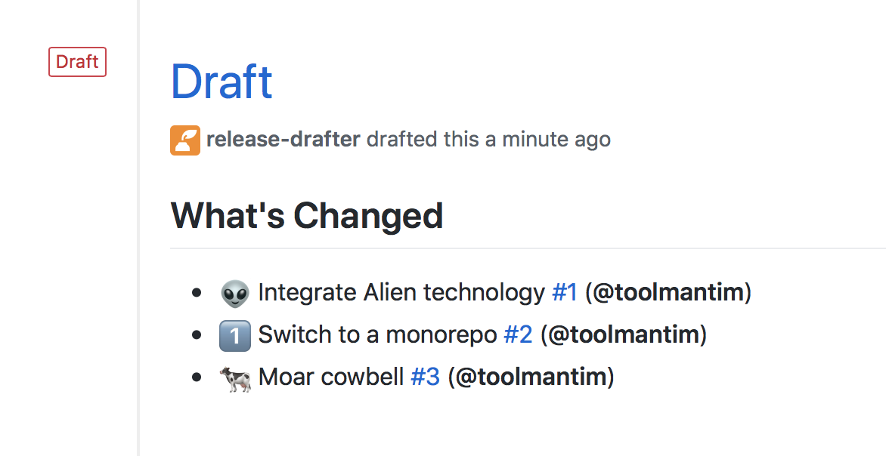
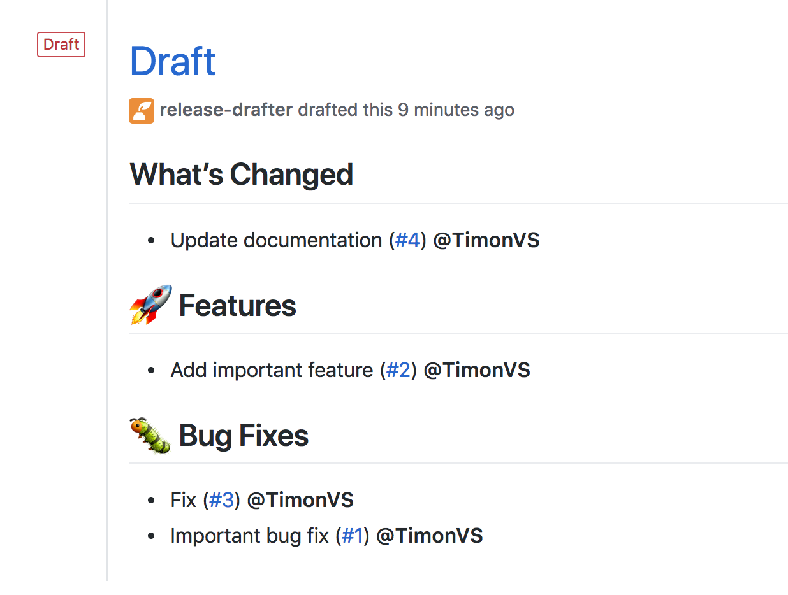

<!-- markdownlint-disable MD033 -->

<h1 align="center">
  
</h1>

<p align="center">Draft the next release notes as pull requests merge into a branch.</p>


## Usage

Add the
[Release Drafter GitHub Action](https://github.com/marketplace/actions/release-drafter)
to a
[GitHub Actions workflow](https://docs.github.com/actions/about-github-actions/understanding-github-actions).
For example, create `.github/workflows/release-drafter.yml` with this content:

```yaml
name: Release Drafter

on:
  push:
    branches:
      - main

# Permissions for the default token.
permissions:
  contents: write
  pull-requests: read

jobs:
  update_release_draft:
    runs-on: ubuntu-slim
    steps:
      - uses: release-drafter/release-drafter@v7
        with:
          # This default loads .github/release-drafter.yml.
          config-name: release-drafter.yml
```

## Command-line interface

Release Drafter provides a CLI for local use and automation. The CLI requires
Node.js 24 or later.

```sh
npx release-drafter owner/repo --dry-run
```

For GitHub.com or GitHub Enterprise Cloud on `*.ghe.com`, authenticate with
`GH_TOKEN` or `GITHUB_TOKEN`. For GitHub Enterprise Server, use
`GH_ENTERPRISE_TOKEN` or `GITHUB_ENTERPRISE_TOKEN`.
Release Drafter does not invoke [`gh`](https://cli.github.com/). To use GitHub
CLI credentials, pass them through `GH_TOKEN`:

```sh
GH_TOKEN="$(gh auth token)" npx release-drafter owner/repo --dry-run
```

The CLI can validate one pull request with the same category rules as the Check
PR action:

```sh
npx release-drafter check-pr owner/repo 123
```

See the [`release-drafter` package README](./packages/release-drafter/README.md)
for installation instructions, the complete option reference, configuration
targets, JSON output, and exit codes.

## Check pull requests

The read-only Check PR action validates a pull request against the title or
label conditions in Release Drafter categories. See
[`check-pr/README.md`](./check-pr/README.md) for the workflow, permissions,
supported events, and matching behavior.

## Configuration

The action requires a configuration file. By default, it loads
`.github/release-drafter.yml` through the GitHub API. You do not need to check
out the repository.

> [!note]
> See [Configuration loading](./docs/configuration-loading.md) to load a
> generated file, extend another configuration, or load from another
> repository.

### Example

Create `.github/release-drafter.yml` with this content:

```yml
template: |
  ## What's Changed

  $CHANGES
```

When a pull request merges, Release Drafter adds the change to a draft release:



This example groups changes and calculates the next version number:

```yml
name-template: 'v$RESOLVED_VERSION 🌈'
tag-template: 'v$RESOLVED_VERSION'
categories:
  - title: '🚀 Features'
    semver-increment: minor
    when:
      labels:
        - 'feature'
        - 'enhancement'
  - title: '🐛 Bug Fixes'
    when:
      labels:
        - 'fix'
        - 'bugfix'
        - 'bug'
  - title: '🧰 Maintenance'
    when:
      label: 'chore'
  - type: 'pre-exclude'
    when:
      label: 'skip-changelog'
  - type: 'version-resolver'
    semver-increment: 'major'
    when:
      label: 'major'
  - type: 'version-resolver'
    semver-increment: 'patch'
change-template: '- $TITLE (#$NUMBER) $AUTHORS'
# Add # and @ to prevent mentions. Add ` to prevent code blocks.
change-title-escapes: '\<*_&'
template: |
  ## Changes

  $CHANGES
```

## Configuration options

The `.github/release-drafter.yml` file supports these keys:

| Key                              | Required | Description                                                                                                                                                                                                                                                                                                                                                          |
| -------------------------------- | -------- | -------------------------------------------------------------------------------------------------------------------------------------------------------------------------------------------------------------------------------------------------------------------------------------------------------------------------------------------------------------------- |
| `template`                       | Required | The template for the body of the draft release. Use [template variables](#template-variables) to insert values.                                                                                                                                                                                                                                                      |
| `header`                         | Optional | Adds text before `template`. Use [template variables](#template-variables) to insert values.                                                                                                                                                                                                                                                                         |
| `footer`                         | Optional | Adds text after `template`. Use [template variables](#template-variables) to insert values.                                                                                                                                                                                                                                                                          |
| `category-template`              | Optional | The template to use for each category. Use [category template variables](#category-template-variables) to insert values. Default: `"## $TITLE"`.                                                                                                                                                                                                                     |
| `name-template`                  | Optional | The template for the name of the draft release. For example: `"v$NEXT_PATCH_VERSION"`.                                                                                                                                                                                                                                                                               |
| `tag-template`                   | Optional | The template for the tag of the draft release. For example: `"v$NEXT_PATCH_VERSION"`.                                                                                                                                                                                                                                                                                |
| `tag-prefix`                     | Optional | A prefix for release tag filtering. Release Drafter removes the prefix before it parses a matching version. Default: `""`.                                                                                                                                                                                                                                           |
| `version-template`               | Optional | The template for the next version number. Use it for projects that do not use Semantic Versioning. Default: `"$MAJOR.$MINOR.$PATCH$PRERELEASE"`.                                                                                                                                                                                                                     |
| `change-template`                | Optional | The template to use for each merged pull request. Use [change template variables](#change-template-variables) to insert values. Default: `"* $TITLE (#$NUMBER) $AUTHORS"`.                                                                                                                                                                                           |
| `change-author-template`         | Optional | The template to use for each author in `$AUTHORS`. Supports `$AUTHOR` for the raw login/name and `$AUTHOR_MENTION` for a GitHub-formatted mention. Default: `"$AUTHOR_MENTION"`.                                                                                                                                                                                     |
| `change-authors-separator`       | Optional | The separator between authors in `$AUTHORS`. Default: `", "`. Use `"\n"` with a list-style `change-author-template` for multiline output.                                                                                                                                                                                                                            |
| `change-authors-final-separator` | Optional | The separator before the final author in `$AUTHORS`. For example, `" and "` produces `@octocat, @cchanche and @jetersen`. Default: the value of `change-authors-separator`.                                                                                                                                                                                          |
| `change-title-escapes`           | Optional | Characters to escape in `$TITLE` when inserting into `change-template` so that they are not interpreted as Markdown format characters. Default: `""`                                                                                                                                                                                                                 |
| `no-changes-template`            | Optional | The template to use when there are no changes. Default: `"* No changes"`.                                                                                                                                                                                                                                                                                            |
| `categories`                     | Optional | Defines how Release Drafter filters and groups changes and selects version increments. Categories support `type`, `when`, `exclusive`, `collapse-after`, and `semver-increment`. See [Categorize changes](#categorize-changes).                                                                                                                                      |
| `exclude-contributors`           | Optional | Excludes specified usernames from `$CONTRIBUTORS`. See [Exclude contributors](#exclude-contributors).                                                                                                                                                                                                                                                                |
| `new-contributor-template`       | Optional | The template to use for each new contributor in `$NEW_CONTRIBUTORS`. Use [new contributor template variables](#new-contributor-template-variables) to insert values. Default: `"* $AUTHOR_MENTION made their first contribution in #$NUMBER"`.                                                                                                                       |
| `no-new-contributor-template`    | Optional | The template to use for `$NEW_CONTRIBUTORS` when there are no new contributors to list. Default: `"* No new contributors"`.                                                                                                                                                                                                                                          |
| `no-contributors-template`       | Optional | The template to use when `$CONTRIBUTORS` has no entries. Default: `"No contributors"`.                                                                                                                                                                                                                                                                               |
| `replacers`                      | Optional | Searches and replaces content in the generated changelog body. See [Replacers](#replacers).                                                                                                                                                                                                                                                                          |
| `sort-by`                        | Optional | Sorts the changelog by `merged_at` or `title`. Default: `merged_at`.                                                                                                                                                                                                                                                                                                 |
| `sort-direction`                 | Optional | Sorts the changelog in `ascending` or `descending` order. Default: `descending`.                                                                                                                                                                                                                                                                                     |
| `prerelease`                     | Optional | Creates a prerelease and includes changes since the previous prerelease when one exists. Default: `false`.                                                                                                                                                                                                                                                           |
| `prerelease-identifier`          | Optional | The prerelease identifier, such as `alpha`, `beta`, or `rc`. This option increments the prerelease version. A configuration-file identifier enables `prerelease` unless the workflow has a `prerelease: false` action input. Default: `''`.                                                                                                                          |
| `include-pre-releases`           | Optional | Includes prereleases when Release Drafter selects the last published release. This option has no effect when `prerelease` is `true`. Default: `false`.                                                                                                                                                                                                               |
| `latest`                         | Optional | Marks a published release as latest. Accepted values: `true`, `false`, and `legacy`. Default: `true`.                                                                                                                                                                                                                                                                |
| `commitish`                      | Optional | The release target. Use a branch, commit SHA, fully qualified tag, or pull request ref. Release Drafter resolves tag and pull request refs to commit SHAs. A pull request merge ref forces dry-run mode because its merge commit is temporary. Set `dry-run: true` to suppress the warning. The default is the workflow branch, such as `main` for pushes to `main`. |
| `filter-by-range`                | Optional | Filter releases whose tag names satisfy a SemVer range. Default: `"*"`.                                                                                                                                                                                                                                                                                              |
| `filter-by-commitish`            | Optional | Considers only previous releases whose target matches `commitish`. Default: `false`.                                                                                                                                                                                                                                                                                 |
| `pull-request-limit`             | Optional | Limits results from the `associatedPullRequests` API call. Use this option for long-lived non-default branches. See [#1354](https://github.com/release-drafter/release-drafter/issues/1354). Default: `5`.                                                                                                                                                           |
| `history-limit`                  | Optional | The page size for repository history requests. A smaller value can prevent intermittent GitHub 502 responses. Default: `15`.                                                                                                                                                                                                                                         |

## Template variables

Use these variables in `template`, `header`, and `footer`:

| Variable            | Description                                                                                                 |
| ------------------- | ----------------------------------------------------------------------------------------------------------- |
| `$CHANGES`          | The Markdown list of merged pull requests.                                                                  |
| `$CONTRIBUTORS`     | A comma-separated list of pull request authors, commit authors, and commit committers for the release.      |
| `$NEW_CONTRIBUTORS` | A Markdown list of pull request authors making their first contribution and the corresponding pull request. |
| `$PREVIOUS_TAG`     | The previous release tag.                                                                                   |
| `$REPOSITORY`       | The current repository.                                                                                     |
| `$OWNER`            | The current repository owner.                                                                               |

## Category template variables

Use these variables in `category-template`:

| Variable | Description                             |
| -------- | --------------------------------------- |
| `$TITLE` | The category title, such as `Features`. |

## Next version variables

Use these variables in `template`, `header`, `footer`, `name-template`, and
`tag-template`:

| Variable                   | Description                                                                                                                         |
| -------------------------- | ----------------------------------------------------------------------------------------------------------------------------------- |
| `$NEXT_PATCH_VERSION`      | The next patch version number. If the last tag or release is `v1.2.3`, the value is `v1.2.4`. This is the most commonly used value. |
| `$NEXT_MINOR_VERSION`      | The next minor version number. If the last tag or release is `v1.2.3`, the value is `v1.3.0`.                                       |
| `$NEXT_MAJOR_VERSION`      | The next major version number. If the last tag or release is `v1.2.3`, the value is `v2.0.0`.                                       |
| `$NEXT_PRERELEASE_VERSION` | The next prerelease version. It depends on `prerelease-identifier`. Example: `v1.2.3-beta.3`. Default: `''`.                        |
| `$RESOLVED_VERSION`        | The next version from the matching category `semver-increment` values. See [Version resolver](#version-resolver).                   |

### Next version component helpers

Each `$NEXT_{MAJOR,MINOR,PATCH}_VERSION` variable has component variables:

| Variable                              | Description                                                             |
| ------------------------------------- | ----------------------------------------------------------------------- |
| `$NEXT_MAJOR_VERSION_MAJOR`           | Major component of `$NEXT_MAJOR_VERSION`.                               |
| `$NEXT_MAJOR_VERSION_MINOR`           | Minor component of `$NEXT_MAJOR_VERSION`.                               |
| `$NEXT_MAJOR_VERSION_PATCH`           | Patch component of `$NEXT_MAJOR_VERSION`.                               |
| `$NEXT_MINOR_VERSION_MAJOR`           | Major component of `$NEXT_MINOR_VERSION`.                               |
| `$NEXT_MINOR_VERSION_MINOR`           | Minor component of `$NEXT_MINOR_VERSION`.                               |
| `$NEXT_MINOR_VERSION_PATCH`           | Patch component of `$NEXT_MINOR_VERSION`.                               |
| `$NEXT_PATCH_VERSION_MAJOR`           | Major component of `$NEXT_PATCH_VERSION`.                               |
| `$NEXT_PATCH_VERSION_MINOR`           | Minor component of `$NEXT_PATCH_VERSION`.                               |
| `$NEXT_PATCH_VERSION_PATCH`           | Patch component of `$NEXT_PATCH_VERSION`.                               |
| `$NEXT_PRERELEASE_VERSION_PRERELEASE` | Prerelease segment of `$NEXT_PRERELEASE_VERSION`. Example: `'-beta.3'`. |

## Version template variables

Use these variables in `version-template` to format the
[next version variables](#next-version-variables):

| Variable      | Description                                                     |
| ------------- | --------------------------------------------------------------- |
| `$PATCH`      | The patch version number.                                       |
| `$MINOR`      | The minor version number.                                       |
| `$MAJOR`      | The major version number.                                       |
| `$PRERELEASE` | The prerelease suffix (for example `-rc.0`) or an empty string. |

Use `version-template` for output that does not use Semantic Versioning.

```yaml
version-template: 'ver $MAJOR'
```

> [!IMPORTANT]
>
> To let the next Release Drafter run parse the version, use a value that
> `semver.coerce()` accepts in loose mode.
>
> ```ts
> semver.coerce('ver 1', true) // { version: '1.0.0' }
> ```
>
> To add text to the release name, use `name-template`. Keep the version
> compatible with Semantic Versioning.

## Version resolver

Any category with `semver-increment` contributes to `$RESOLVED_VERSION`. Use
`type: version-resolver` categories when you want version resolution rules that
do not also render a changelog section.

Before version resolution runs, any `pre-include` and `pre-exclude` categories
filter the candidate pull requests. After that:

- `type: changelog` categories contribute only for pull requests assigned to
  that changelog category.
- `type: version-resolver` categories contribute from their own matches without
  rendering a changelog section.
- The highest matching increment wins across both category types.

Category order matters when `exclusive` is `true`. Release Drafter evaluates
exclusivity independently for changelog and version resolver categories.

```yml
categories:
  - type: 'version-resolver'
    semver-increment: 'major'
    when:
      label: 'major'
  - type: 'version-resolver'
    semver-increment: 'minor'
    when:
      label: 'minor'
  - type: 'version-resolver'
    semver-increment: 'patch'
    when:
      label: 'patch'
  - type: 'version-resolver'
    semver-increment: 'patch'
```

This example:

- Uses matching categories to resolve `major`, `minor`, or `patch`.
- Uses the category with no `when` as the fallback when nothing else matches.
- Selects the highest Semantic Versioning increment across matching categories.

## New contributor template variables

Use these variables in `new-contributor-template`:

| Variable          | Description                                                                                          |
| ----------------- | ---------------------------------------------------------------------------------------------------- |
| `$AUTHOR`         | The new contributor's username. Example: `gracehopper`.                                              |
| `$AUTHOR_MENTION` | The new contributor's GitHub mention. Example: `@gracehopper`.                                       |
| `$AUTHOR_URL`     | The URL of the new contributor's GitHub profile. Example: `https://github.com/gracehopper`.          |
| `$NUMBER`         | The number of the contributor's first pull request. Example: `42`.                                   |
| `$URL`            | The URL of the contributor's first pull request. Example: `https://github.com/octocat/repo/pull/42`. |

## Change template variables

Use these variables in `change-template`:

| Variable         | Description                                                                                                                                                                                                                                                                                |
| ---------------- | ------------------------------------------------------------------------------------------------------------------------------------------------------------------------------------------------------------------------------------------------------------------------------------------ |
| `$NUMBER`        | The pull request number. Example: `42`.                                                                                                                                                                                                                                                    |
| `$CATEGORY`      | The title of the category that matched the pull request, preserving its configured case. Empty for uncategorized pull requests.                                                                                                                                                            |
| `$TITLE`         | The pull request title. Example: `Add alien technology`. Release Drafter prefixes characters in `change-title-escapes`, except `@` and `#`, with a backslash. Markdown then displays these characters as text. For `@` and `#`, Release Drafter adds an HTML comment to prevent a mention. |
| `$AUTHOR`        | The pull request author's username. Example: `gracehopper`.                                                                                                                                                                                                                                |
| `$AUTHOR_URL`    | The pull request author's GitHub profile URL. Example: `https://github.com/gracehopper`.                                                                                                                                                                                                   |
| `$AUTHORS`       | The pull request author and associated commit authors, rendered with `change-author-template` and joined with `change-authors-separator`. The pull request author is first.                                                                                                                |
| `$BODY`          | The pull request body. Example: `Fixed spelling mistake`.                                                                                                                                                                                                                                  |
| `$URL`           | The pull request URL. Example: `https://github.com/octocat/repo/pull/42`.                                                                                                                                                                                                                  |
| `$BASE_REF_NAME` | The name of the pull request base ref. Example: `main`.                                                                                                                                                                                                                                    |
| `$HEAD_REF_NAME` | The name of the pull request head ref. Example: `my-bug-fix`.                                                                                                                                                                                                                              |

For a multiline author list, render each author with `$AUTHOR` and join them
with a newline:

```yaml
categories:
  - title: bug
    when:
      label: bug
  - title: todo
category-template: ''
change-template: |-
  - type: $CATEGORY
    message: |-
      $TITLE
    pull: $NUMBER
    authors:
      $AUTHORS
change-author-template: '- $AUTHOR'
change-authors-separator: "\n    "
```

Use `$AUTHOR_MENTION` instead of `$AUTHOR` in `change-author-template` to create
GitHub mentions. Release Drafter renders GitHub App bots as linked
mentions, for example `[@dependabot[bot]](https://github.com/apps/dependabot)`.
`$CATEGORY` preserves `categories[].title`; configure the title with the casing
required by the output.

## Categorize changes

The `categories` option defines the change classification sequence:

- `type: changelog` groups matching changes in the rendered release notes.
- `type: pre-include` keeps only matching changes for later processing.
- `type: pre-exclude` removes matching changes before changelog generation.
- `type: version-resolver` affects `$RESOLVED_VERSION` without rendering a
  changelog section.

`pre-include` always runs before `pre-exclude`, and both category types affect
both changelog generation and version resolution.

Release Drafter evaluates categories in configuration order. By default, a pull
request can match multiple categories of the same type. Setting
`exclusive: true` on a `changelog` or `version-resolver` category stops later
categories of that same type from also matching the same pull request.

Each category supports these keys:

| Key                | Applies to                      | Description                                                                                                                                               |
| ------------------ | ------------------------------- | --------------------------------------------------------------------------------------------------------------------------------------------------------- |
| `type`             | All categories                  | Category behavior. Defaults to `changelog`.                                                                                                               |
| `title`            | `changelog`                     | Required for changelog categories because `category-template` renders it. Ignored for `pre-include`, `pre-exclude`, and `version-resolver`.               |
| `when`             | All categories                  | Match conditions. Omit it or use an empty array to match all changes.                                                                                     |
| `exclusive`        | `changelog`, `version-resolver` | Prevents later categories of the same type from also matching the same pull request. Defaults to `false`.                                                 |
| `collapse-after`   | `changelog`                     | Collapses long changelog sections into `<details>`. `0` always collapses, `-1` disables collapsing. Defaults to `-1`.                                     |
| `semver-increment` | `changelog`, `version-resolver` | Version increment contributed by matching changes. Can be `major`, `minor`, or `patch`. Defaults to `patch`. Ignored for `pre-include` and `pre-exclude`. |

Each category can define `when` in one of these forms:

- One condition object.
- An array of condition objects. A match against one object is sufficient.

Within one condition, conventional commit, label, and path predicates are
combined with AND logic.

The condition keys are:

| Key            | Description                                                                    |
| -------------- | ------------------------------------------------------------------------------ |
| `conventional` | Conventional commit predicates to compare against the change title or message. |
| `label`        | Shorthand for one `labels` entry.                                              |
| `labels`       | Label predicates to compare against the pull request labels.                   |
| `labels-mode`  | Method for label matching. Default: `any`.                                     |
| `path`         | Shorthand for one `paths` entry.                                               |
| `paths`        | Glob patterns to compare against the files changed by the change.              |
| `paths-mode`   | Method for path matching. Default: `any`.                                      |

```yml
categories:
  - title: '🚀 Features'
    semver-increment: 'minor'
    when:
      - conventional:
          type: 'feat'
      - labels:
          - 'feature'
          - 'enhancement'
  - title: '🐛 Bug Fixes'
    when:
      - labels:
          - 'bug'
          - 'fix'
      - labels:
          - 'regression'
        paths:
          - 'src/**'
  - title: '⬆️ Dependencies'
    collapse-after: 0
    exclusive: true
    when:
      label: 'dependencies'
  - type: 'pre-exclude'
    when:
      label: 'skip-changelog'
```

The `labels-mode` and `paths-mode` options control the comparison of configured
labels and path patterns. `any` is the default. Path matching uses the
pull request's changed files.

The `conventional` option parses the pull request title as a conventional commit
header. Set it to `true` to match any conventional title, or configure
`type`/`types`, `scope`/`scopes`, and `breaking`:

```yml
categories:
  - title: 'Conventional Changes'
    when:
      conventional: true
  - title: '🚀 Features'
    semver-increment: 'minor'
    when:
      conventional:
        type: 'feat'
  - title: '💥 Breaking API Changes'
    semver-increment: 'major'
    when:
      conventional:
        type: 'feat'
        scope: 'api'
        breaking: true
```

Within a condition, `label` is shorthand for a single `labels` entry. If both
`label` and `labels` are present, they are combined before `labels-mode` is
applied. With the default `labels-mode: any`,
`labels: ["feature", "enhancement"]` matches pull requests carrying either
label.

Likewise, `path` is shorthand for a single `paths` entry. If both `path` and
`paths` are present, they are combined before `paths-mode` is applied.

The matching modes are:

- `any`: at least one configured value matches
- `all`: every configured value matches
- `only`: every change value is included in the configured set
- `exactly`: the change values and configured values are the same set

If a condition does not configure any `label`/`labels` or `path`/`paths`, the
corresponding `*-mode` setting has no effect.

An omitted or empty `when` matches all changes, but the meaning depends on the
category type:

- At most one `type: changelog` category can omit `when`. It receives otherwise
  uncategorized changes.
- A `type: version-resolver` category with no `when` is the fallback when no
  other version resolver category matches.
- `pre-include` and `pre-exclude` categories with no `when` match every change.

Release Drafter groups changes that have matching labels or paths:



Use the [Autolabeler action](#autolabeler) to add these labels.

Set `collapse-after` to collapse a category that has more than the specified
number of pull requests. A value of `0` always collapses the category. A value
of `-1` disables collapsing.

```yml
categories:
  - title: '⬆️ Dependencies'
    collapse-after: 3
    when:
      label: 'dependencies'
```

## Exclude changes

Use a `type: pre-exclude` category to exclude changes. For example, add this
category to `.github/release-drafter.yml`:

```yml
categories:
  - type: 'pre-exclude'
    when:
      label: 'skip-changelog'
```

Release Drafter excludes changes with the `skip-changelog` label from the
release draft.

## Include changes

Use a `type: pre-include` category to include only a subset of changes. Release
Drafter keeps changes that match at least one `pre-include` category. For
example, add this category to `.github/release-drafter.yml`:

```yml
categories:
  - type: 'pre-include'
    when:
      labels:
        - 'app-foo'
```

Release Drafter includes only changes with the `app-foo` label in the release
draft.

## Exclude contributors

By default, `$CONTRIBUTORS` contains the names or usernames of all release
contributors. Use `exclude-contributors` to remove specified usernames from the
list.

```yml
exclude-contributors:
  - 'myusername'
```

## Replacers

Use `replacers` to search and replace content in the generated changelog body.
Release Drafter applies the regular expressions in configuration order.

```yml
replacers:
  - search: '/CVE-(\d{4})-(\d+)/g'
    replace: 'https://cve.mitre.org/cgi-bin/cvename.cgi?name=CVE-$1-$2'
  - search: 'myname'
    replace: 'My Name'
  - search: '/- ([a-z])/g'
    replace: '- \u$1' # Uppercase the first letter of each changelog entry
```

Release Drafter parses `search` as a regular expression. `replace` supports the
[Visual Studio Code replacement syntax](https://code.visualstudio.com/docs/editing/codebasics#_case-changing-in-regex-replace).

## Autolabeler

Use the Autolabeler action to add labels to pull requests.

```yaml
name: Auto Label

on:
  pull_request:
    # Autolabeler handles these event types.
    types: [opened, reopened, synchronize]
  # Use pull_request_target to label pull requests from forks.
  # pull_request_target:
  #   types: [opened, reopened, synchronize]

permissions:
  contents: read

jobs:
  auto_label:
    permissions:
      pull-requests: write
    runs-on: ubuntu-slim
    steps:
      # Runs Autolabeler.
      - uses: release-drafter/release-drafter/autolabeler@v7
```

The available matchers are `files` for glob patterns and `branch`, `title`, and
`body` for regular expressions. Autolabeler evaluates each matcher
independently. It adds the label if at least one matcher succeeds.

```yml
# .github/release-drafter.yml
autolabeler:
  - label: 'chore'
    files:
      - '*.md'
    branch:
      - '/docs{0,1}\/.+/'
  - label: 'bug'
    branch:
      - '/fix\/.+/'
    title:
      - '/fix/i'
  - label: 'enhancement'
    branch:
      - '/feature\/.+/'
    body:
      - '/JIRA-[0-9]{1,4}/'

# Add the remaining Release Drafter configuration here.
```

## Prerelease workflow

Release Drafter supports prerelease workflows. A typical sequence is:

- Publish a stable release, such as `v3.5.0`.
- Merge changes for the next release.
- Publish a prerelease, such as `v3.5.0-rc.1`.
- Merge more changes.
- Publish another prerelease, such as `v3.5.0-rc.2`.
- Publish the next stable release, such as `v3.5.1`.

Use the `prerelease` and `prerelease-identifier` action inputs or configuration
keys to draft stable releases and prereleases.

```yaml
jobs:
  update_full_release_draft:
    runs-on: ubuntu-slim
    steps:
      - uses: release-drafter/release-drafter@v7
        with:
          prerelease: false # the default
          # Add the remaining configuration here.
  update_prerelease_draft:
    runs-on: ubuntu-slim
    steps:
      - uses: release-drafter/release-drafter@v7
        with:
          prerelease: true
          # Use a Semantic Versioning identifier such as alpha, beta, or rc.
          prerelease-identifier: 'rc'
```

Both jobs run in parallel for changes to the configured branch.

- `update_full_release_draft` collects changes since `v3.5.0` in a draft for
  `v3.5.1`, `v3.6.0`, or `v4.0.0`, according to the configuration.
- `update_prerelease_draft` collects changes since the last published
  prerelease. If no published prerelease exists, it collects changes since
  `v3.5.0` in a draft for `v3.5.0-rc.1`. If `v3.5.0-rc.1` exists, it collects
  changes since that release in a draft for `v3.5.0-rc.2`.

Set `publish: true` on `update_prerelease_draft` to publish each prerelease
without manual approval. This setting removes the manual review of the
prerelease contents.

> [!IMPORTANT]
>
> - `prerelease-identifier` is optional when `prerelease` is enabled. Without an
>   identifier, the release tag might not be a valid Semantic Versioning
>   prerelease tag.
> - A configuration-file `prerelease-identifier` enables `prerelease: true`
>   unless the workflow has a `prerelease: false` action input. A
>   `prerelease-identifier` action input always enables `prerelease: true`.

Set `include-pre-releases: true` to include changes since the last prerelease
instead of the last stable release. The stable release body then contains only
changes after the last prerelease.

## Projects that do not use Semantic Versioning

If your project does not follow [Semantic Versioning](https://semver.org), set
`version-template` to define the `$NEXT_{PATCH,MINOR,MAJOR}_VERSION` values.

For example, set `version-template` to `$MAJOR.$MINOR` if the project does not
use patch versions. If the current release is `1.0`, `$NEXT_MINOR_VERSION` is
`1.1`.

## Action inputs

The Release Drafter action accepts optional workflow inputs. Inputs override the
corresponding values in `release-drafter.yml`.

| Input                   | Description                                                                                                                                                                                                                                    |
| ----------------------- | ---------------------------------------------------------------------------------------------------------------------------------------------------------------------------------------------------------------------------------------------- |
| `config-name`           | Release Drafter configuration target. A relative path starts in the repository's `.github` directory.                                                                                                                                          |
| `token`                 | Access token for GitHub API requests. Default: `${{ github.token }}`.                                                                                                                                                                          |
| `dry-run`               | Prevents write operations. The action logs the proposed release operation. Default: `false`.                                                                                                                                                   |
| `name`                  | Overrides `name-template` with the specified release name.                                                                                                                                                                                     |
| `tag`                   | Overrides `tag-template` with the specified release tag.                                                                                                                                                                                       |
| `filter-by-range`       | Filter releases whose tag names satisfy a SemVer range.                                                                                                                                                                                        |
| `version`               | Overrides the version that Release Drafter calculates.                                                                                                                                                                                         |
| `from`                  | Ref, tag, branch, or commit SHA to use as the change comparison baseline. This value does not select the release version or the draft release to update.                                                                                       |
| `publish`               | Publishes the created or updated release immediately. Set it from an earlier version-detection step, such as [`salsify/action-detect-and-tag-new-version`](https://github.com/salsify/action-detect-and-tag-new-version).                      |
| `prerelease`            | Creates a prerelease and includes changes since the previous prerelease when one exists. Default: `false`.                                                                                                                                     |
| `prerelease-identifier` | Sets the prerelease identifier, such as `alpha`, `beta`, or `rc`. This input enables `prerelease`. Default: `''`.                                                                                                                              |
| `include-pre-releases`  | Includes prereleases when Release Drafter selects the last published release. This input has no effect when `prerelease` is `true`. Default: `false`.                                                                                          |
| `latest`                | Controls whether GitHub marks the created or updated release as latest.                                                                                                                                                                        |
| `commitish`             | The release target. Use a branch, commit SHA, fully qualified tag, or pull request ref. Release Drafter resolves tag and pull request refs to commit SHAs. A pull request merge ref forces dry-run mode because its merge commit is temporary. |
| `header`                | Text to add before the template body.                                                                                                                                                                                                          |
| `footer`                | Text to add after the template body.                                                                                                                                                                                                           |

## Action outputs

The Release Drafter action sets outputs for later workflow steps.

| Output             | Description                                                                                             |
| ------------------ | ------------------------------------------------------------------------------------------------------- |
| `id`               | The ID of the release that was created or updated.                                                      |
| `name`             | The name of this release.                                                                               |
| `tag_name`         | The name of the tag associated with this release.                                                       |
| `body`             | The body of the drafted release.                                                                        |
| `html_url`         | The URL for viewing the release. For example, `https://github.com/octocat/Hello-World/releases/v1.0.0`. |
| `upload_url`       | The URL for uploading release assets.                                                                   |
| `resolved_version` | Version from the [version resolver](#version-resolver). Example: `6.3.1`.                               |
| `major_version`    | Major component of the resolved version. Example: `6` for `6.3.1`.                                      |
| `minor_version`    | Minor component of the resolved version. Example: `3` for `6.3.1`.                                      |
| `patch_version`    | Patch component of the resolved version. Example: `1` for `6.3.1`.                                      |

## GitHub Enterprise Server (GHES)

The GitHub Actions runtime creates the GitHub client through the GitHub adapter.
It passes the action token and the runtime
`GITHUB_SERVER_URL`, `GITHUB_API_URL`, and `GITHUB_GRAPHQL_URL` values to the
GitHub adapter. If the GitHub Enterprise Server instance supports the required
REST and GraphQL APIs, the same workflow can target it without
`github.com`-specific configuration.

## Adopters

A non-exhaustive list of the projects and organizations using Release Drafter
lives in [ADOPTERS.md](ADOPTERS.md). If you use Release Drafter, please add
yourself.

## Contributing

See [CONTRIBUTING.md](docs/CONTRIBUTING.md) for contribution instructions.

> [!IMPORTANT]
>
> Before pushing, run `npm run ci` to format, lint, type-check, test, and
> regenerate all build artifacts. The CI pipeline enforces that no uncommitted
> changes remain after these steps.

For help, open
[a GitHub issue](https://github.com/release-drafter/release-drafter/issues/new).
