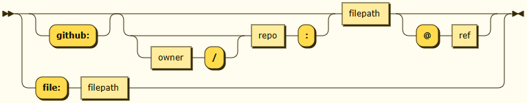

# Configuration Loading

When specifying your `config-name:` inside the action's inputs, you can leverage
a variety of syntax combinations to fetch your config file(s).

- [Configuration Loading](#configuration-loading)
  - [The syntax](#the-syntax)
  - [Recipes](#recipes)
    - [Target a different folder](#target-a-different-folder)
    - [Load your config from another repo](#load-your-config-from-another-repo)
    - [Load a file on the runner's file-system (dynamic config)](#load-a-file-on-the-runners-file-system-dynamic-config)
    - [Extend other config files using `_extends`](#extend-other-config-files-using-_extends)
  - [Org-wide config via the `.github` repo](#org-wide-config-via-the-github-repo)
  - [Edge-cases](#edge-cases)
    - [Load config from your default branch](#load-config-from-your-default-branch)
    - [Fetching from a repo named `github`](#fetching-from-a-repo-named-github)
    - [Avoid changing _schemes_ during `_extends:` import chain](#avoid-changing-schemes-during-_extends-import-chain)

## The syntax

The full syntax can be represented as follows :

- either `[github:][[owner/]repo]:filepath[@ref]`
- or `file:filepath`

... discriminated by the _scheme_ : `file` or `github` (the default).

<p align="center">
  
</br><sup>Grammar diagram - generated by
<a href="https://www.bottlecaps.de/rr/ui" target="_blank">RR - Railroad Diagram Generator</a></sup>
</p>

Everything besides the `filepath` is optional. This path is interpreted such as
you can easily navigate your repo's files :

- relative _filepaths_ are resolved your repo's `.github` folder
- absolute _filepaths_ are resolved at your repo's root folder

When using the `github:` scheme, you'll be able to specify a different repo
and/or ref to fetch the config at. If you do not specify any/some of them,
they'll be inferred using the runner's context. See
[Variables reference](https://docs.github.com/en/actions/reference/workflows-and-actions/variables)
and
[`@actions/github`'s `context`](https://github.com/actions/toolkit/blob/main/packages/github/src/context.ts)
for more.

The `file:` schemes requires the runtime's file-system (the runner's) to have
the file at hand. If the desired file is in your repo, make sure to use
`actions/checkout`.

> [!note]  
> If you want to use an unmodified copy of the config that was pushed to your
> repo on the same event your workflow is running for, you need neither the
> `file:` scheme nor the `actions/checkout` action.
>
> Simply use the default `github:` scheme :
>
> ```yaml
> uses: release-drafter/release-drafter@v7
> with:
>   config-name: relative/path/to/my/config.yaml
> ```
>
> ... release-drafter will automatically fetch your file from your
> working/current branch using octokit.

## Recipes

### Target a different folder

- `config-name: release-drafter.yaml`
  - resolves `.github/release-drafter.yaml` using the
    [contents Github API endpoint](https://docs.github.com/en/rest/repos/contents)
- `config-name: /configs/release-drafter.yaml`
  - resolves `configs/release-drafter.yaml` using the
    [contents Github API endpoint](https://docs.github.com/en/rest/repos/contents)
- `config-name: file:../src/common/release-drafter.yaml`
  - resolves `/home/runner/workspace/src/common/release-drafter.yaml` using
    `node:fs`

### Load your config from another repo

- `config-name: .github:release-drafter.yaml@v2`
  - resolves `.github/release-drafter.yaml` inside your `.github` repo at tag
    `v2`
- `config-name: my_configs:release-drafter.yaml`
  - resolves `.github/release-drafter.yaml` inside your `my_configs` repo on the
    default branch
- `config-name: torvalds/dotfiles:/ci/release-drafter.yml@v6.19-rc8`
  - resolves Linus's release-drafter config

### Load a file on the runner's file-system (dynamic config)

```yaml
# .github/release-drafter-template.yml
template: |
  $CHANGES

  **Full Changelog**: generated by {{CURR_REF}}
```

```yaml
# .github/workflows/release.yml
jobs:
  release-drafter:
    runs-on: ubuntu-latest
    steps:
      - uses: actions/checkout@v6
      - name: Generate dynamic config from template using 'sed'
        run:
          sed "s|{{CURR_REF}}|${{ github.ref }}|g"
          .github/release-drafter-template.yml >
          .github/release-drafter-parsed.yml
      - name: Use dynamic release-drafter configuration
        uses: release-drafter/release-drafter@v7
        with:
          config-name: file:release-drafter-parsed.yml
```

### Extend other config files using `_extends`

```yml
# configs/release-drafter-common.yml
template: |
  ## What’s Changed

  $CHANGES
```

```yml
# .github/release-drafter/backend.yml
_extends: /configs/release-drafter-common.yml
tag-template: 'backend/v$RESOLVED_VERSION'
```

```yaml
steps:
  - uses: release-drafter/release-drafter@v7
    with:
      config-name: release-drafter/backend.yml
```

Imported config will be :

```yml
tag-template: 'backend/v$RESOLVED_VERSION'
template: |
  ## What’s Changed

  $CHANGES
```

> [!note]  
> The same syntax as `config_name:` applies to `_extends`. Below all produce the
> same output :
>
> - `_extends: ../configs/release-drafter-common.yml`
> - `_extends: github:/configs/release-drafter-common.yml`
> - `_extends: github:../configs/release-drafter-common.yml`
> - `_extends: file:../configs/release-drafter-common.yml`
>   - make sure to `actions/checkout@v6` the repo beforehand

### Org-wide config via the `.github` repo

If release-drafter cannot find the config file in the current repository, it
will automatically look for it in your organisation's
[`.github` repository](https://docs.github.com/en/communities/setting-up-your-project-for-healthy-contributions/creating-a-default-community-health-file).

This means you can keep a single shared config in `<your-org>/.github` and all
repositories in your organisation will pick it up without any per-repo
configuration:

```yaml
# <your-org>/.github/.github/release-drafter.yml
template: |
  ## What's Changed

  $CHANGES
```

> [!note]
> The fallback only applies when:
>
> - the `config-name:` does not explicitly target another repository, and
> - release-drafter is **not** already running inside the `.github` repository
>   itself (to avoid an infinite loop).

## Edge-cases

### Load config from your default branch

When not specifying a ref (with `@ref`), octokit will fetch from the default
branch of the repo.

However, our implementation of the config-loading will automatically set a value
for this ref parameter whenever the target repo and repo owner are the same
release-drafter is running for.

For instance, if you are running :

```yaml
# github.com/john_doe/my_repo/.github/workflows/release.yaml
on:
  push:
    branches:
      - feature/implement-auth

jobs:
  release-drafter:
    runs-on: ubuntu-latest
    steps:
      - uses: release-drafter/release-drafter@v7
        with:
          config-name: release-drafter.yaml
```

... This will fetch
`https://github.com/john_doe/my_repo/.github/workflows/release.yaml?ref=feature/implement-auth`.

If you need to fetch to your default branch instead, you will need to know the
name of your default branch :

```yaml
config-name: release-drafter.yaml@main
```

... or get it from your workflow's context :

```yaml
config-name: release-drafter.yaml@${{ github.event.repository.default_branch }}
```

### Fetching from a repo named `github`

The `github:` prefix is used internally to recognize you want to explicitly
fetch from a remote (using octokit) instead of loading a file on the runtime's
filesystem.

The same prefix could also be used if you wanted to specify fetching from a repo
you own named `github`.

For instance, `github:release-drafter.yaml` would mean both :

- fetch from current repo at current ref
- and fetch from my repo named `github`

If you intent the later, you will need to be more explicit. Use either :

- `my_org_or_name/github:release-drafter.yaml`
- or `github:github:release-drafter.yaml`
- or even `github:my_org_or_name/github:release-drafter.yaml`

### Avoid changing _schemes_ during `_extends:` import chain

When configs _extend_ each-other, release-drafter will need to walk the
import-chain using the scheme that whas specified in every file.

Using the `file:` scheme with `_extends` is supported, but you need to make sure
all files are on the system and on the correct path.

If you start extending configs using the `github:` (default, recommended)
scheme, you cannot switch to `file:` _mid-flight_.
