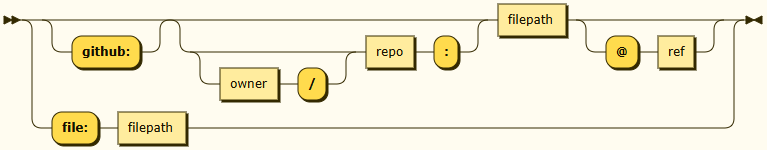

<!-- markdownlint-disable MD033 -->

# Configuration loading

Use the `config-name` action input to select a configuration file. Release
Drafter can load the file from a GitHub repository or the runner file system.

## Syntax

Use one of these forms:

- `[github:][[owner/]repo:]filepath[@ref]`
- `file:filepath`

The optional scheme is `github:` or `file:`. The default is `github:`.

<p align="center">
  
<br /><sup>Grammar diagram generated with the
<a href="https://www.bottlecaps.de/rr/ui" target="_blank">Railroad Diagram Generator</a>.</sup>
</p>

For `config-name`, only `filepath` is required. Release Drafter resolves it as
follows:

- A relative path starts in the repository's `.github` directory.
- An absolute path starts at the repository root.

With the `github:` scheme, specify another repository or ref. Release Drafter
gets omitted values from the GitHub Actions context. See the
[Variables reference](https://docs.github.com/en/actions/reference/workflows-and-actions/variables)
and
[`@actions/github`'s `context`](https://github.com/actions/toolkit/blob/main/packages/github/src/context.ts)
for the available context values.

The `file:` scheme loads a file from the runner file system. If the file is in
the repository, run `actions/checkout@v6` before Release Drafter.

> [!note]
> To load the committed configuration for the current event, use the default
> `github:` scheme. You do not need `actions/checkout`.
>
> ```yaml
> uses: release-drafter/release-drafter@v7
> with:
>   config-name: relative/path/to/my/config.yaml
> ```

## Recipes

### Load from another directory

- `config-name: release-drafter.yaml`
  - Loads `.github/release-drafter.yaml` with the
    [GitHub Contents API](https://docs.github.com/en/rest/repos/contents).
- `config-name: /configs/release-drafter.yaml`
  - Loads `configs/release-drafter.yaml` with the GitHub Contents API.
- `config-name: file:../src/common/release-drafter.yaml`
  - Loads `src/common/release-drafter.yaml` from the repository workspace with
    `node:fs`.

### Load from another repository

- `config-name: .github:release-drafter.yaml@v2`
  - Loads `.github/release-drafter.yaml` from your `.github` repository at tag
    `v2`.
- `config-name: my_configs:release-drafter.yaml`
  - Loads `.github/release-drafter.yaml` from your `my_configs` repository on
    its default branch.
- `config-name: torvalds/dotfiles:/ci/release-drafter.yml@v6.19-rc8`
  - Loads the Release Drafter configuration from that repository and ref.

### Load a generated file from the runner

```yaml
# .github/release-drafter-template.yml
template: |
  $CHANGES

  **Full Changelog**: generated by {{CURR_REF}}
```

```yaml
# .github/workflows/release.yml
jobs:
  release-drafter:
    runs-on: ubuntu-slim
    steps:
      - uses: actions/checkout@v6
      - name: Generate configuration from template
        run: |
          sed "s|{{CURR_REF}}|${{ github.ref }}|g" \
            .github/release-drafter-template.yml \
            > .github/release-drafter-parsed.yml
      - name: Use generated Release Drafter configuration
        uses: release-drafter/release-drafter@v7
        with:
          config-name: file:release-drafter-parsed.yml
```

### Extend other config files using `_extends`

```yml
# configs/release-drafter-common.yml
template: |
  ## What's Changed

  $CHANGES
```

```yml
# .github/release-drafter/backend.yml
_extends: /configs/release-drafter-common.yml
tag-template: 'backend/v$RESOLVED_VERSION'
```

```yaml
steps:
  - uses: release-drafter/release-drafter@v7
    with:
      config-name: release-drafter/backend.yml
```

Release Drafter produces this configuration:

```yml
tag-template: 'backend/v$RESOLVED_VERSION'
template: |
  ## What's Changed

  $CHANGES
```

> [!note]
> `_extends` and its `from` mapping key use the same syntax as `config-name`.
> These values select the same file:
>
> - `_extends: ../configs/release-drafter-common.yml`
> - `_extends: github:/configs/release-drafter-common.yml`
> - `_extends: github:../configs/release-drafter-common.yml`
> - `_extends: file:../configs/release-drafter-common.yml`
>
> The `file:` example requires `actions/checkout@v6` before Release Drafter.

### Merge strategies for `_extends`

Configurations in an `_extends` chain use a shallow merge. A key in the
extending file replaces the inherited value. For list keys such as `categories`,
`autolabeler`, and `replacers`, the extending file must repeat the inherited
list to add entries.

The mapping form of `_extends` sets a merge strategy for each key. `from`
selects the target with the same syntax as the string form. `strategy` maps
configuration keys to merge strategies:

```yml
# your-org/.github: .github/release-drafter.yml
categories:
  - title: '🚀 Features'
    when:
      label: 'feature'
```

```yml
# your-repo: .github/release-drafter.yml
_extends:
  from: your-org/.github
  strategy:
    categories: append
categories:
  - type: 'pre-exclude'
    when:
      label: 'skip-changelog'
```

Release Drafter produces this configuration:

```yml
categories:
  - title: '🚀 Features'
    when:
      label: 'feature'
  - type: 'pre-exclude'
    when:
      label: 'skip-changelog'
```

The strategies have these rules:

- `override` is the default. It replaces the inherited value.
- `append` puts the extending file's entries after the inherited list.
- `prepend` puts the extending file's entries before the inherited list.
- Category evaluation follows configuration order. The selected strategy sets
  the position of the extending file's categories.
- `append` and `prepend` only work on list values. Merging a key whose own or
  inherited value is present and not a list fails with an error naming the key
  and the file. An absent or empty (`categories:`) value counts as an empty
  list.
- A file's `strategy` controls only the step that merges the file with the
  configurations that it extends. The strategy is not inherited. In a chain
  `A extends B extends C`, `B`'s strategy applies when `B` is merged onto `C`.
  Then, `A`'s strategy applies when `A` is merged onto the result. A file without
  a strategy overrides, even if a file below it appended.
- Like the string form, the `_extends` key is removed from the composed
  configuration and does not reach the configuration schema.

> [!warning]
> Older Release Drafter versions accept only the string form of `_extends`.
> Repositories that use the mapping form must use a version that supports it.

### Share configuration through the `.github` repository

If Release Drafter cannot find the configuration file in the current
repository, it searches the organization's
[`.github` repository](https://docs.github.com/en/communities/setting-up-your-project-for-healthy-contributions/creating-a-default-community-health-file).

Store a shared configuration in `<your-org>/.github` to use it in repositories
that do not have their own file:

```yaml
# <your-org>/.github/.github/release-drafter.yml
template: |
  ## What's Changed

  $CHANGES
```

> [!note]
>
> The fallback only applies when:
>
> - `config-name` does not select another repository.
> - Release Drafter is not running in the `.github` repository. This restriction
>   prevents a lookup loop.

## Edge cases

### Load configuration from the default branch

When a target does not include `@ref`, Octokit loads the file from the
repository's default branch.

For the repository that triggered the workflow, Release Drafter instead uses the
current ref from the GitHub Actions context.

For example, this workflow runs on `feature/implement-auth`:

```yaml
# github.com/octocat/example/.github/workflows/release.yaml
on:
  push:
    branches:
      - feature/implement-auth

jobs:
  release-drafter:
    runs-on: ubuntu-slim
    steps:
      - uses: release-drafter/release-drafter@v7
        with:
          config-name: release-drafter.yaml
```

Release Drafter loads `.github/release-drafter.yaml` from
`feature/implement-auth`.

To load the file from the default branch, specify the branch name:

```yaml
config-name: release-drafter.yaml@main
```

The workflow context also provides the name:

```yaml
config-name: release-drafter.yaml@${{ github.event.repository.default_branch }}
```

### Load from a repository named `github`

The `github:` prefix selects the GitHub scheme. Therefore,
`github:release-drafter.yaml` selects `release-drafter.yaml` in the current
repository. It does not select a repository named `github`.

To select a repository named `github`, include a repository separator. Use one
of these forms:

- `octocat/github:release-drafter.yaml`
- `github:github:release-drafter.yaml`
- `github:octocat/github:release-drafter.yaml`

### Use one scheme in an `_extends` chain

Release Drafter uses the selected scheme to load each file in an `_extends`
chain.

The `file:` scheme supports `_extends`. All files in the chain must exist on the
runner at the expected paths.

A chain that starts with the `github:` scheme cannot switch to the `file:`
scheme.
